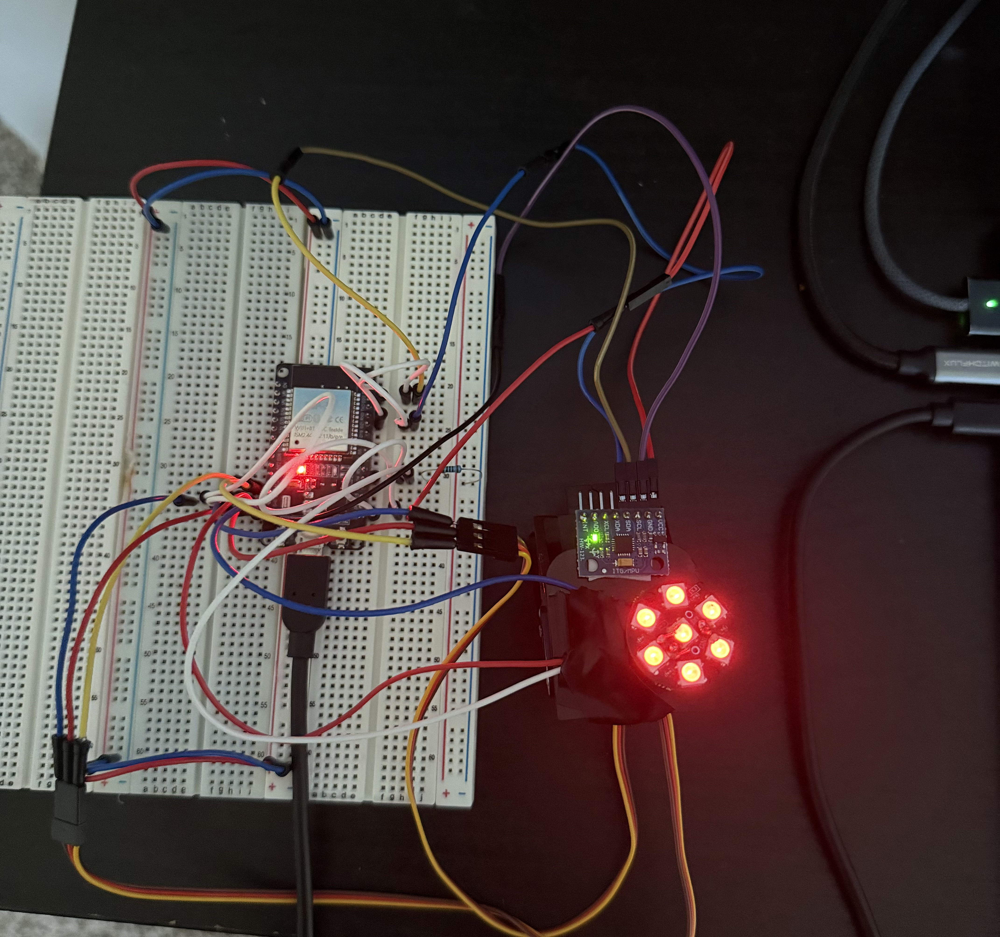

# ESP32 Satellite Tracker

Hello everyone! I decided to make one of the projects I made this semester open source. I used an ESP32 module and some servo motors to make a satellite tracker that tracks the ISS when it is above 5° in elevation. I did this with an ESP32 since I have never used a pure microcontoller before, only raspberry pis running a traditional OS (Debian Pi OS). (I will be adding more sat traking and uploading the code soon, when I get back home from Mass.)




---

## Features

- **Live TLE fetching** — grabs orbital data from Celestrak over WiFi, refreshes every 6 hours. I used Heavens Above to verify satellite pass info during testing.
- **Onboard orbit propagation** — computes satellite position locally, no internet needed between refreshes
- **Real-time az/el tracking** — updates at 20Hz and commands servos to follow the satellite
- **NeoPixel status ring** — blue spinning (waiting), green chase (tracking), red pulse (lost)
- **IMU telemetry** — live pitch/roll from the pan/tilt platform
- **WiFi auto-reconnect** — handles dropped connections gracefully
- **GPS upgrade in progress** — integrating NEO-6M GPS for automatic observer location (replacing hardcoded coordinates)

---

## Hardware

| Part | Link | Price |
|------|------|-------|
| ESP32-WROOM-32 Dev Board | [Amazon](https://www.amazon.com/dp/B07WCG1PLV?th=1) | $9.39 |
| HiLetgo GY-521 MPU-6050 IMU | [Amazon](https://www.amazon.com/dp/B00LP25V1A?th=1) | $11.79 |
| Mini Pan-Tilt Kit with SG90 Servos | [Amazon](https://www.amazon.com/dp/B0DG8QCP58) | $13.99 |
| DIYMall WS2812B 7-LED NeoPixel Ring | [Amazon](https://www.amazon.com/dp/B0C77TVKL6?ref=ppx_yo2ov_dt_b_fed_asin_title&th=1) | $15.99 |
| Micro-USB to USB-C Cable | [Amazon](https://www.amazon.com/dp/B0D97GS238?ref=ppx_yo2ov_dt_b_fed_asin_title&th=1) | $4.49 |
| 3M Double-Sided Mounting Tape | [Amazon](https://www.amazon.com/dp/B0007P5G8Y) | $4.79 |
| Breadboard(s) + Jumper Wires | — | Already had |

**Total: ~$60.44**

You will also need a soldering iron, flux, and solder to wire the connections on the IMU and LED ring. Soldering takes some practice so you may want to buy extras just in case you mess up. (Don't ask me how I know that)

---

## Wiring

```
ESP32          MPU-6050 (on pan/tilt platform)
GPIO21 (SDA) ↔ SDA
GPIO22 (SCL) ↔ SCL
3.3V         → VCC
GND          → GND
GND          → AD0

ESP32          SG90 Pan Servo
GPIO13        → Signal (orange)
5V/VIN        → VCC (red)
GND           → GND (brown)

ESP32          SG90 Tilt Servo
GPIO12        → Signal (orange)
5V/VIN        → VCC (red)
GND           → GND (brown)

ESP32          WS2812B NeoPixel Ring
GPIO4         →[1KΩ]→ DIN
5V/VIN        → PWR5V
GND           → GND

```

---

## Software Setup

### Requirements

- Arduino IDE 1.8.x
- ESP32 board package by Espressif Systems
- Libraries:
  - `TinyGPS++` by Mikal Hart
  - `Adafruit NeoPixel`
  - `ESP32Servo` by Kevin Harrington
  - `ArduinoJson` v6.x by Benoit Blanchon

### Install board package

In Arduino IDE preferences, add this URL:
```
https://raw.githubusercontent.com/espressif/arduino-esp32/gh-pages/package_esp32_index.json
```
Then install **esp32 by Espressif Systems** from the Boards Manager.

### Note on code

I will not be uploading the code at this time as it needs cleanup, it has hardcoded location data. Will upload here when that gets fixed :)

---

## Future Upgrades

- [ ] **NEO-6M GPS** — automatic observer location instead of hardcoded coordinates (in progress)
- [ ] **Multi-satellite support** — build a GUI to switch between tracking different satellites
- [ ] **Code cleanup** — a lot of personal location data is hardcoded, need to clean up before posting
- [ ] **More images and videos** — I have a bad habit of not documenting my projects, will upload when I get back to Texas (Currently in Mass for work) 

---

**Mustafa Alawad**

CS Senior @ The University of Texas at Dallas

[IEEE AP-S/URSI 2025 Co-Author](https://ieeexplore.ieee.org/document/11266806)

Prev Research Assistant @ [UN Lab, Northeastern University](https://unlab.tech/team_members/mustafa-alawad/)

Founding Team Member @ [Teralink Technologies](https://teralink.space)

Website: [mustafa-alawad.com](https://mustafa-alawad.com/)

---

## License

MIT
